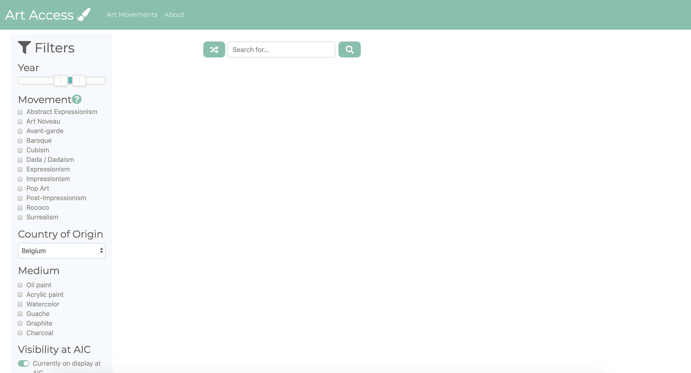
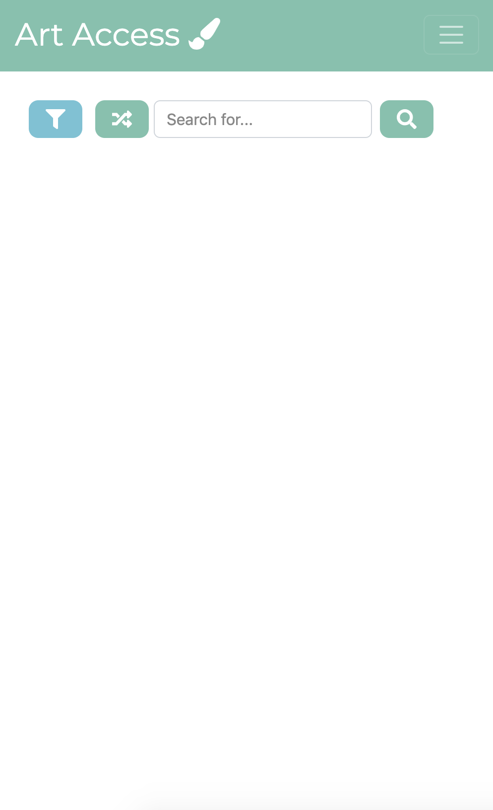

# Art Institute of Chicago: A Digital Experience
## Problem and Related Work
### Problem and Motivation
Consuming and creating art is a universal human experience, but unfortunately it’s often more accessible to some than others. The cost of tickets, transportation, parking, and time consumption make the experience not accessible to everyone. For people who have a genuine interest in studying art and culture, having every piece of information on hand would be ideal. In this project, we propose ArtAccess, a web-based platform that utilizes the Art Institute of Chicago’s new public API to display artworks based on a number of configurable parameters.
### Analysis
Currently, there are a few websites that provide works from artists from different museums, such as ​https://artsandculture.google.com/​, ​https://folkartmuseum.org/​, ArtBrowser​, etc. However, they don’t provide users with an intuitive array of filters to find something particular that they want, and some are more geared towards selling modern artists’ works. There is a Chrome extension that uses the AIC’s API to display a random piece of artwork every time the user opens a new tab, but that also does not solve the problem. 
  
Our app will be one of the only apps giving users options about what they want to see. By incorporating an intuitive “explore” functionality, coupling with its filterable search capabilities,  it may expose more people to the art than in the past. We do not intend to replace actually going to the museum but are merely providing a supplement. The granularity of API allows the user to potentially search by artist, keywords, place of origin, the text description found beside the artwork in the museum, the medium of the piece, the dominant color of the work, and much more. 

## User Research

### Interviews and Observations
#### Research Approach
We hoped to learn: 
<ul>
    <li>How users perceive art museums and the 21st-century alternative - web/mobile apps.</li> 
    <li>If economic and income disparity, not belonging to the art community, and distance from the museum were a hindrance to going to museums</li> 
    <li>If users had previous experience with these kinds of apps and if it was useful</li> 
    <li>Use cases, glitches/difficulties in using such apps</li> 
    <li>User perspective to evaluate how it differed from our assumptions</li> 
</ul>
We decided to do a mix of contextual inquiry/interview and a traditional questionnaire.

#### Part I- Contextual Inquiry
<ol>
    <li>Observe them using Wikiart and Google Arts and Culture</li>
    <li>Introduce yourself and our problem statement. Describe the structure of this interview. Make the interviewee feel comfortable, and assure them that we’re evaluating the websites together (it is not us evaluating the interviewee). </li>
    <li>In Wikiart: Ask the user to search for artwork of “people eating or drinking together” - let them pick the search terms. See if Nighthawks (1942), by Edward Hopper, comes up (don’t mention it, hide artist and name in window): 
        https://www.artic.edu/artworks/111628/nighthawks </li>
    <li>Show them just the image of Nighthawks (link above), and ask them to search for that particular image -- don’t tell them the name or the artist (if they already know, then ask them not to use that in the query).</li>
    <li>Repeat steps 3-4 for Google Arts.</li>
</ol>

#### Part II- Interview
Now that contextual inquiry is done, ask the following questions:
<ol>
    <li>How many times a year do you go to a museum? How many times do you wish you could go? How often might you use an art app instead?</li>
    <li>Have you felt like there are structural or societal barriers that have kept you from going to the museum more often?</li>
    <li>Were you familiar with Google Arts or Wikiart before this experience? If so, what parts of it have you used?</li>
    <li>How might you use the app in your daily life? (ex: tool to find album art)</li>
    <li>How was your experience using Wikiart and Google Arts? Which did you prefer, and why? </li>
    <li>Is there anything in the web apps that would’ve made the task easier?</li>
    <li>Any other thoughts or feelings you had while using these apps?</li>
</ol>

#### What we learned
We found that the user needs were primarily around better search functionality and receiving more information about the artwork. Users were frustrated that Google Arts and Culture didn’t only show artwork, but other images as well. The results of the users’ searches were not always obviously related, which made relevant art difficult to find. We were also intrigued that the users wanted more details about the artwork than what was offered on both Google Arts and Culture and WikiArt. The UI played a vital role in the user preferring one application to the other. In terms of the search functionality, we found that the users’ searches were not successful most of the time. 
  
Users expressed an interest in:
<ul>
    <li>Understanding the relationship between different artworks</li>
    <li>Understanding the progression and development of an artist’s work overtime</li>
    <li>Learning more details about the artwork including what the piece depicts, the thought process behind it, how popular it is, and how many people have viewed it.</li>
    <li>Idea of a community for art enthusiasts that allowed them to comment and share artwork. </li>
</ul>

None of the users claimed they witnessed any societal or structural barriers in the form of classism or racism. The main obstacles in the way of getting to the museum regularly were a lack of time, financial barriers, and physical accessibility.

#### Re-shaping the project idea
We observed that most of the users showed frustration with the search functionality and features. The new goal of our project was to deliver an accessible art browsing experience, where users can easily and organically search for artwork and receive more information on the pieces that furthers their appreciation of the art.

### Personas, Scenarios, & Features
#### Personas
<strong>Noor</strong>
 

 
27, PhD candidate for computational social science
 
Bio: Noor lives in Skokie while she’s working towards her PhD at Northwestern University. She’s a hard worker who loves cooking challenging dishes, heart-to-heart conversations with friends, and cracking into a fresh book when she has time. 
 
Needs: Noor loves balancing the technical parts of her computational research with philosophical and artistic hobbies. She likes anything that challenges her perspective, or encourages her to think, and wants more opportunities to discuss artistic meaning with other people.
 
Pain Points:  She wishes she had more time for museums and cultural events, but has struggled to squeeze them into her busy schedule. This is particularly tough with the limited transportation to Skokie. Noor doesn’t have the resources to take an art history class, but wants to learn more about the patterns in art and how works change over time. 

---

<strong>John</strong>
 

 
55, Mechanical Engineer
 
Bio: John has been staying in Chicago for the past 35 years now and loves the cold weather. He drives his son to school when needed and likes to go on tours around the world. He’s a father of two who lives in his bungalow.
 
Needs: John likes to know about the cultures of different places and their evolution with time. He likes chatting in the native language of the places he visits. He strongly believes that storytelling by locals and museums are the best depictions of cultures. 
 
Pain points: It has become quite difficult for John to plan tours these days given the schedule of his children and wife. Also due to his age and related medical restrictions, he cannot fly every now and then.

---

<strong>Lizzie</strong>
 

 
28, Artist: painter
 
Bio: Lizzie is an artist/painter and works at a Creative Art Studio based out of Naperville. As a part of her job Lizzie often conducts step-by-step canvas painting art sessions for couples and private parties. 
 
Needs: Lizzie is on the constant lookout for fresh art pieces and artworks that can be used as an inspiration for her sessions. She believes that artists learn from looking at other artist’s works, during her art major she often wandered leisurely through museums and local art galleries and could spend hours immersing herself in the strokes, techniques and focus of a particular artwork. 
 
Pain Points: Finding the time to visit museums and keeping within her monthly budget. 

---

<strong>Jennifer</strong>
 

 
25, Researcher
 
Bio: Jennifer is a PhD candidate in biology in UChicago. She is interested in contemporary art, and often visits Chicago Art Institute for new exhibitions. 
 
Needs: Jennifer wants to be able to virtually visit art exhibitions throughout the world, as she can not travel due to time constraints. She has been using the WikiArt platform constantly for the last 2 years. However, she is still not satisfied with UX of the platform, since it doesn’t give real-experience. 
 
Pain points: It is hard to reach the art institute by public transportation, I need to switch three times the buses in order to reach downtown Chicago.

---

<strong>Lauren</strong>
 

 
34, Occupational Therapist
 
Bio: Lauren is a millennial mom with 2 young children under 6. She works during the weekdays but has evenings and weekends to do fun activities with her kids. While not an art enthusiast or scholar, she enjoys museums and learning about art and history. She lives in the suburbs and is a significant drive from the nearest city.
Needs: Lauren would like to make it to the museum more often (or really, at all!) with her children.
 
Pain Points: She lives away from the city and has found it difficult to travel to museums, especially with 2 kids in tow.

---

#### Scenarios
Scenario 1:
Noor is picking photos for her new personal website. She wants to search for an image of a floral painting she had seen at the Art Institute of Chicago last year, but she can’t remember the title or artist. She only remembers what the flowers looked like, the main colors used, and that it was from Italy.
 
 
Scenario 2:
John wishes there was some easier way to quench his thirst for knowledge of art and culture. He tried a few museum websites but with the level of familiarity with technology, he finds it quite overwhelming. 
 
 
Scenario 3:
Lizzie is looking for popular artworks to teach at her next canvas painting art-studio session but can’t find any inspiring works of art, moreover, most of her web search results are low-resolution artworks. 
 
 
Scenario 4:
Jennifer wants to have a better digital platform which can give more useful and interesting information about the Artwork. The platform also should have a simple yet intuitive user interface, because available platforms are quite complex and hard to navigate. 
 
 
Scenario 5:
Lauren wants to do an arts and crafts activity with her 5 year old where they make pictures out of dots (pointillism). She would like to use one website to pull up examples of this style for her and her child to explore together while creating their own art.

#### Features
Essential Features:
<ul>
    <li>Searching based on an artistic style would help Lauren find examples of the particular style she was seeking for her activity. Noor also wants to find art based on certain parameters like artist name, piece name, and time period.</li>
    <li>A way for users like John to explore art options when they don’t have anything in particular in mind and find the other searching features overwhelming -- such as  viewing artworks randomly chosen by the platform. </li>
    <li>Users like Lizzie could benefit from a categorized search, such as top ten most popular artworks or books inspired from famous artworks to keep her work at the studio fresh and relevant. </li>
</ul>

Nice-to-have Features:
<ul>
    <li>Suggesting art/artists/styles related to what was searched may help users find more examples of what they’re looking for, potentially giving them better results. This could help Lauren find more examples of what she was searching for, as well as provide inspiration for her next art activity.</li>
    <li>Users like Noor expressed interest in the idea of an artist community, one that allows users to leave comments and or start conversations about popular artworks.</li>
    <li>John mentioned having a need to explore different cultures around the world and not just Chicago, so a feature that allows us to integrate information from other cultural institutions would be ideal.</li>
</ul>

## Paper Prototyping

### Observations
Our first user explored with the arrows, searched with the search bar, and used filters when appropriate. Our second user used the search bar only, was confused by the arrows on the landing page and didn’t understand what the filter icon meant. The third user used the filter for both exploration and search, even when a filter wasn’t relevant in completing the task. The users expressed interest in a “save image” button and an option to make the image larger (they all tried to click the image). Overall, the users were able to complete the tasks, though in different ways.

### Resolutions
For our next steps, we need to:
<ol>
    <li>Research arrow button designs that would communicate their utility more directly to the user. </li>
    <li>Find examples of filter buttons or labels that are more explicit. 
Like having filters permanently visible as a sidebar, include better instructions or label the buttons
</li>
    <li>Research the API for more relevant filters</li>
    <li>Explore the API to see if we can get high resolution images, add a “save image” for downloading the image.</li>
    <li>Labeling the “Related Images” on the side of the image may be helpful for users who aren’t sure what the purpose of those images are </li>
</ol>

## High-Fidelity Prototyping

### Prototype 1
#### Task
Find a painting of flowers in a style of art that interests you. (ex: Impressionism) 
Alternatively, find a painting of still life objects from a particular time period. 
#### Components 
Interactive Data Filter and Form: For the current round, as suggested to take the most complex component first, we decided to implement the “Filter” function of our project. It is one of the most important components since it is connected to almost every other feature of our prototype.

#### How this component supports the task:
The form allows the user to enter their prefered filter options to help them find a painting from flowers from a particular art movement, or still life objects from a particular time period. The interactive data filter enables the user to then search the AIC collection with those specified search options. For instance, a user might check the “Impressionism” box and set the Country of Origin to “France”, apply the filters by clicking the Apply button in the form, and then enter “flowers” into the search bar. A photo from the AIC data that matches their search criteria will be displayed on the page.

### Prototype 2
#### Task
Find a painting of flowers in a style of art that interests you. (ex: Impressionism) 

#### Components 
TM Branding: We used the branding protocols of Bootstrap toolkit with changes to different aspects including font, color, etc., while keeping in mind the basic design principles. 

#### How this component supports the task:
We want our app to be as simple and straightforward as possible, and our design communicates this. Our use of whitespace helps the user understand what to do when reaching our page. The energetic colors, the rounded fonts, and the rounded elements add a welcoming and easy going feel to our app, which allows users to explore art in a casual and low stress way. Our design expresses simplicity, inspiration, and creativity through our branding components. A user would not use an art website if it is not visually pleasing! 

### Prototype 3
#### Task
Find paintings by an artist you’re interested in. (ex: Vincent Van Gogh) 
#### Components 
Responsive UI 
 
We decided to implement the Responsive UI component, which means our web application had dynamic elements that flex to comfortably fit mobile, tablet, and desktop-sized screens. 
 

 

#### How this component supports the task:
Our mobile design makes our app accessible on various devices and is in line with our overall goal of accessibility. We want our users to be able to find art they’re interested in no matter what device they’re accessing our site from. We learned through our user research and testing that many users were frustrated by the UI of current art searching tools like Google Arts and WikiArt. We implemented this component so users could have a frustration free user experience while using our app.

## Reflection
### What we managed to accomplish in the time we had
<ul>
    <li>We delved into design and branding to create an aesthetically pleasing web application that follows established design patterns.</li>
    <li>We created a web app that calls the Art Institute of Chicago’s API and displays images, titles, dates, and a link to the work after just pressing a button.</li>
    <li>We implemented responsive design to make our application accessible to those on various devices.</li>
    <li>We created different input fields and created custom inputs (the year slider) to create a form for our data filter.</li>
</ul>

### Next steps if we had more time
<ul>
    <li>We would work on getting a description about artist and movement from Wikipedia besides the image display.</li>
    <li>We would try to work on color based search through some API or a Machine Learning model.</li>
    <li>A social element where users can comment on pictures and share their views on artworks and connect with like-minded people.</li>
</ul>

## Links
[Our Repository](https://github.com/ArtAccess/AIC)
 
[Art Access](https://artaccess.github.io/AIC/)

### Instructions to run our app:
It is as simple as going to the [Art Access](https://artaccess.github.io/AIC/) link. It is best viewed using Chrome on a desktop.

